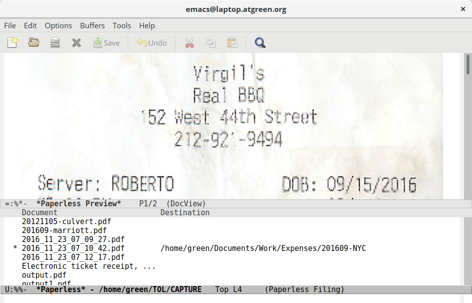

[](https://melpa.org/#/paperless) [](https://travis-ci.org/atgreen/paperless)

# paperless.el - Emacs assisted PDF document filing

You've just scanned a stack of papers that have been cluttering up
your desk.  Now what?  Paperless mode is an Emacs major mode designed
to assist with the filing of scanned documents into a hierarchy of
folders.



Paperless mode provides PDF document previews, ido-based target
directory completion, and simple batch filing commands designed to
simplify and speed the filing of all of your scanned documents.

Here's how it works...

## Step 1

Scan your documents and dump them into a holding directory.  Set the
variable `paperless-capture-directory` to reference this directory.
Use `M-x customize-variable` to set this string.

## Step 2

Tell paperless-mode where to file the documents by setting
`paperless-root-directory` with `M-x customize-variable`, or you can
set both variables in your `~/.emacs/init.el` like so:

```lisp
(custom-set-variables
 '(paperless-capture-directory "/home/green/CAPTURE")
 '(paperless-root-directory "/home/green/Documents"))
```

Under `paperless-root-directory`, create a hierarchy of directories that
makes sense for you.  For example, you might create directories to
sort documents like so:

```
[paperless-root-directory]/Finance
                             /Taxes
                                /2015
                                /2016
                             /Insurance
                                /Car
                                /Home
                             /Work
                                /Expenses
                                   /2016-FOSDEM
                                   /20170102-NYC
                                   /20170202-SFO
                          /Medical
                             /Receipts
                                /2016
                                /2017
                          /Utilities
                             /Mobile
                             /Electricity
```

At the time of this writing, the author's directory tree contains over
620 folders.

## Step 3

Once loaded, start paperless with `M-x paperless` and you'll be
presented with a list of PDF files in `paperless-capture-directory`.
Use the `[SPC]` key to open PDF preview buffers.  Use the `r` key to
rename the file.  If you omit a filename extention, paperless will
append ".pdf" to your new filename.  Use the `f` key to select the
destination directory.  Files aren't renamed or moved until you select
the `x` key.

## Installation

Simply download this package to your local filesystem, and add
something like the following to your ~/.emacs/init.el:

```lisp
(autoload 'paperless "paperless" "A major mode for filing PDFs" t)
(add-to-list 'load-path
	     (expand-file-name "/home/green/git/paperless/"))
```

Don't forget to change load path, or to set
`paperless-capture-directory` and `paperless-root-directory` as per
above.

## Licensing

Copyright (C) 2016 by Anthony Green

Paperless is provided under the terms of the 3-clause BSD license.
See paperless.el for details.
